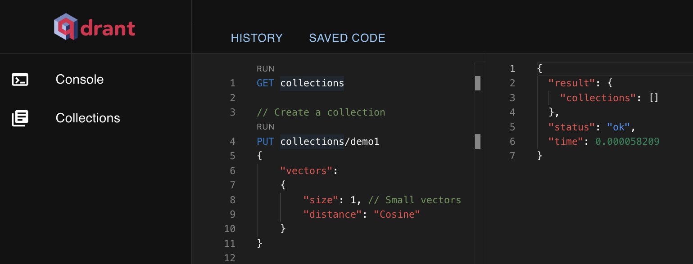

# Qdrant CI/CD pipeline

Deploy Qdrant server with CI/CD on Elestio

 
 

# Once deployed ...

You can open Qdrant ADMIN UI here:

    URL: https://[CI_CD_DOMAIN]/dashboard
    password: [ADMIN_PASSWORD]
